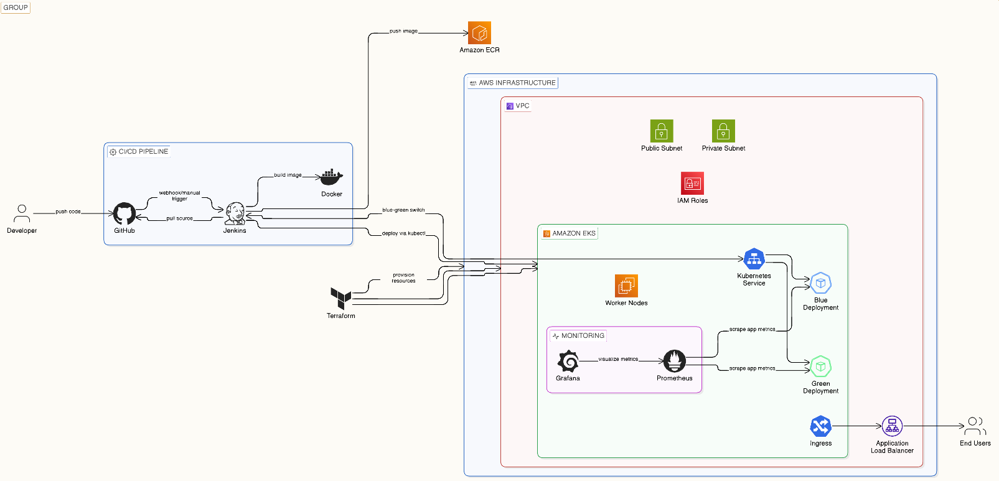
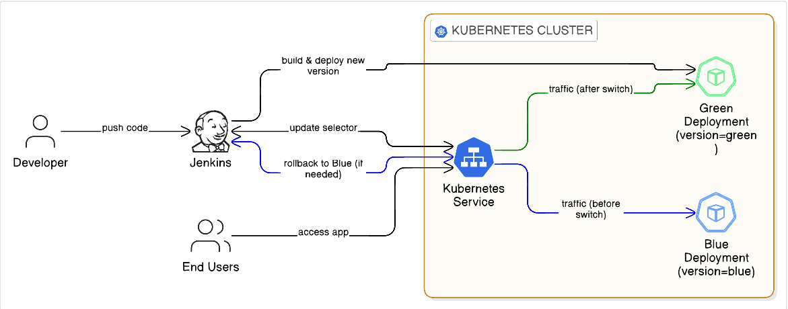
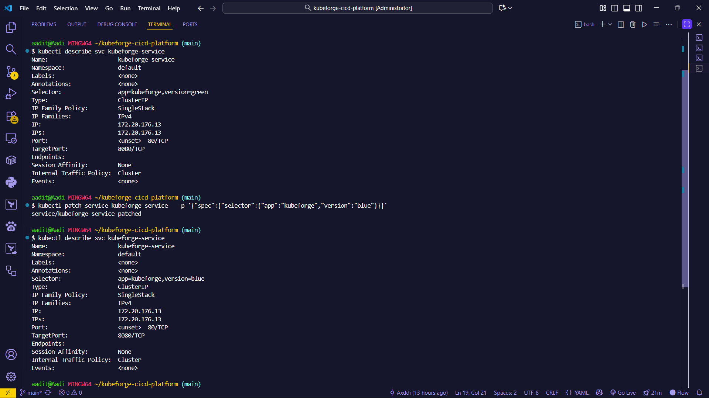
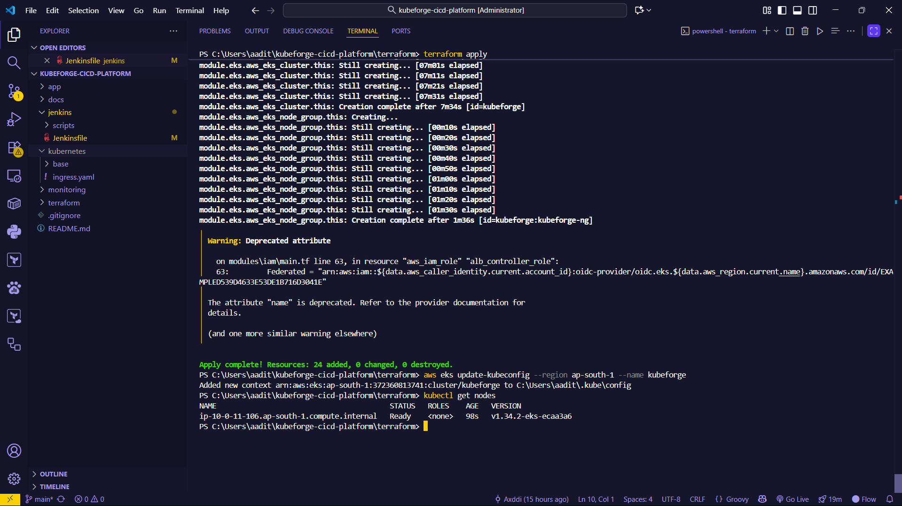
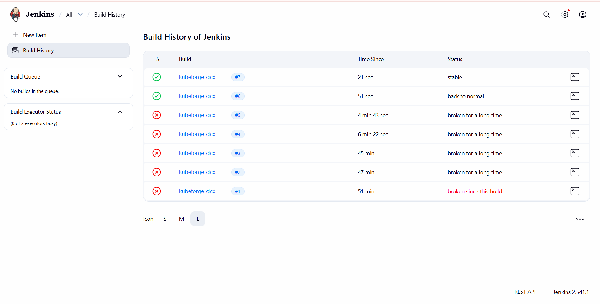
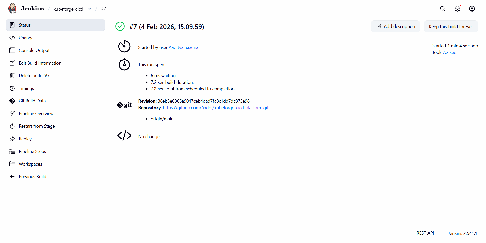
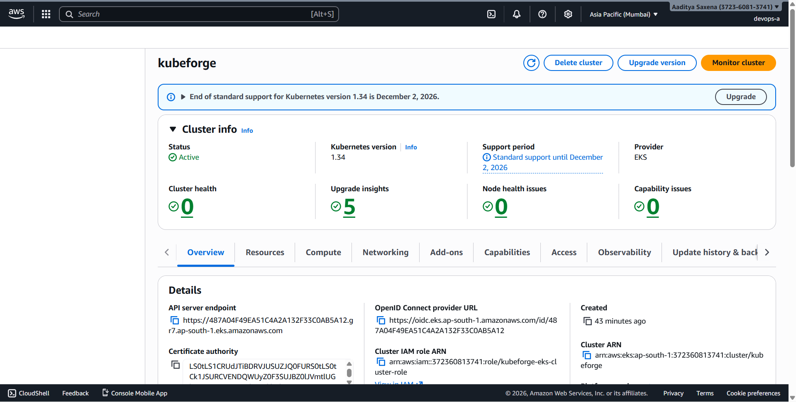
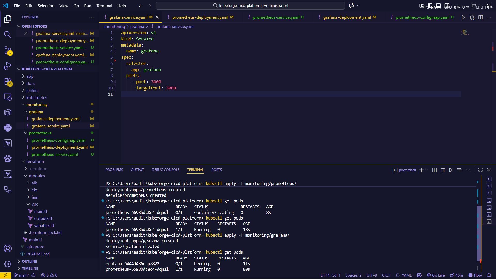
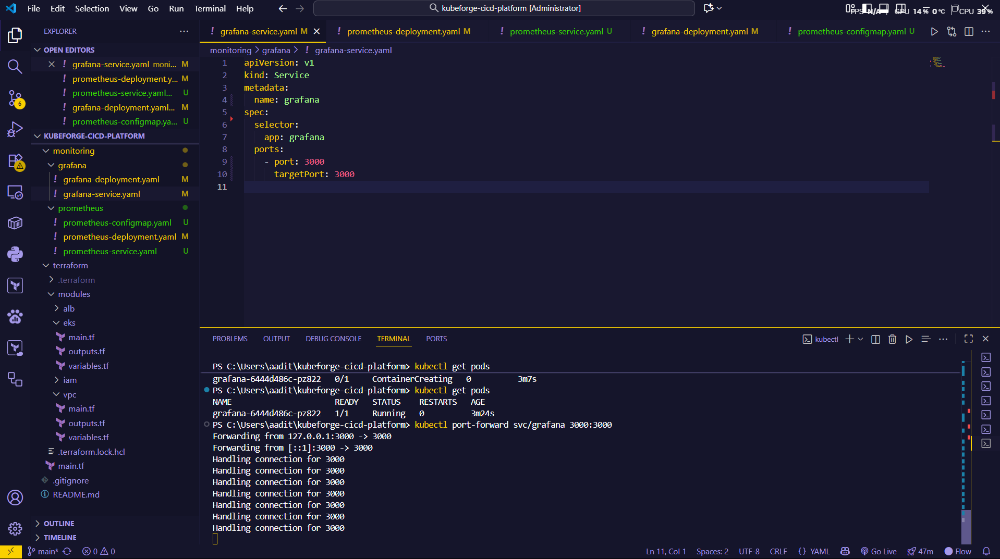

# Kubeforge 

A **production‑grade CI/CD platform** that automatically builds, tests, and deploys containerized microservices on Kubernetes using a **Blue‑Green deployment strategy**, fully provisioned with **Terraform on AWS**, orchestrated by **Jenkins**, and monitored using **Prometheus and Grafana**.

This project is designed to be **resume‑ready**, **interview‑defensible**, and **cost‑aware**, demonstrating real‑world DevOps workflows on a minimal infrastructure setup.

---


## Key Highlights

* Infrastructure as Code using **Terraform**
* Automated CI/CD pipelines using **Jenkins**
* Containerization with **Docker**
* **Blue‑Green deployments** on Kubernetes (EKS)
* Zero‑downtime traffic switching using Kubernetes Services
* Monitoring & observability with **Prometheus** and **Grafana**
* Cost‑controlled, single‑node EKS validation

---

## Architecture Overview

Kubeforge follows a clean, layered DevOps architecture:

1. **Developer** pushes code to GitHub
2. **Jenkins** pulls the repository and executes the Jenkinsfile
3. Jenkins builds a Docker image tagged with the Git commit hash
4. Jenkins deploys the application to Kubernetes
5. Kubernetes runs **Blue and Green deployments in parallel**
6. A Kubernetes **Service** controls traffic routing
7. Traffic is switched from Blue → Green after validation
8. **Prometheus** scrapes metrics from the cluster
9. **Grafana** visualizes metrics via dashboards

---

## Blue‑Green Deployment Strategy

Kubeforge uses a **Service‑based Blue‑Green deployment model**:

* **Blue Deployment**: Current stable production version
* **Green Deployment**: New application version
* Both versions run simultaneously
* A single Kubernetes Service routes traffic using label selectors




### Traffic Switching

* Initially, Service selector points to `version=blue`
* After successful validation, selector switches to `version=green`
* Traffic moves instantly with **zero downtime**
* Blue remains available for rollback

This approach avoids in‑place updates and enables safe, reversible releases.

---

## Infrastructure (Terraform)

Terraform provisions the following AWS resources:

* VPC with public/private subnets
* IAM roles for EKS and worker nodes
* Amazon EKS cluster
* Managed node group
* Networking and security components

All infrastructure can be created and destroyed predictably using:

```bash
terraform apply
terraform destroy
```

---



## CI/CD Pipeline (Jenkins)

The Jenkins pipeline is defined using a **Declarative Jenkinsfile**.

### Pipeline Stages

1. **Checkout Code** – Pulls source code from GitHub
2. **Set Build Metadata** – Uses Git commit hash as image tag
3. **Build Docker Image** – Builds container image from Dockerfile
4. **CI Validation** – Ensures build success before deploy
5. **Deploy Green Version** – Deploys new version to Kubernetes
6. **Verify Green Deployment** – Ensures Green is healthy
7. **Switch Traffic to Green** – Updates Service selector

If any stage fails, traffic **remains on Blue**, ensuring safety.



---

## Containerization (Docker)

Each microservice is containerized using Docker.

### App Structure

```
app/
├── Dockerfile
├── package.json
├── index.js
└── .dockerignore
```

### Docker Image Strategy

* Images are tagged using Git commit hashes
* Ensures traceability and reproducibility
* Prevents ambiguity between releases

---

## Kubernetes Deployment

Kubernetes manifests define:

* Blue Deployment
* Green Deployment
* Service for traffic routing
* Resource‑efficient configuration for small clusters

The cluster is validated using **sequential workload execution** to remain cost‑efficient.

---



## Monitoring & Observability

### Prometheus

* Deployed inside Kubernetes
* Scrapes metrics from cluster and pods
* Validated independently on a minimal node


### Grafana

* Deployed inside Kubernetes
* Connects to Prometheus as a data source
* Provides visualization and dashboards

Due to cost constraints, Prometheus and Grafana were validated **sequentially**, which preserves architecture correctness while reducing resource usage.



---

## Cost‑Aware Design

* Single‑node EKS cluster
* Sequential validation of workloads
* Aggressive cleanup after testing
* Designed to run within student budgets

This demonstrates **real‑world cost discipline**, a critical DevOps skill.

---

## Validation Artifacts

The project is validated using:

* Terraform apply/destroy outputs
* `kubectl get nodes` and `kubectl get pods`
* Jenkins pipeline execution results
* Docker image build logs
* Prometheus and Grafana running pods
* Grafana UI access via port‑forwarding

These artifacts serve as strong, CLI‑based proof of functionality.

---

## Testing Strategy

* CI failures block deployment automatically
* Green deployment validated before traffic switch
* Blue remains live until success is confirmed
* Rollback is instant via Service selector

---

## How to Run (High‑Level)

1. Provision infrastructure with Terraform
2. Configure kubeconfig for EKS
3. Run Jenkins pipeline
4. Deploy Blue and Green services
5. Switch traffic using Kubernetes Service
6. Deploy monitoring stack
7. Capture validation screenshots
8. Destroy infrastructure

---

## Project Status

* Infrastructure provisioned via Terraform
* CI/CD pipeline implemented with Jenkins
* Dockerized application builds successfully
* Blue‑Green deployment validated
* Monitoring stack validated
* Cost‑controlled teardown completed

---

## Key Learnings

* End‑to‑end CI/CD pipeline design
* Kubernetes deployment strategies
* Service‑based traffic management
* Observability fundamentals
* Debugging real DevOps failures
* Cost‑efficient cloud engineering

---
